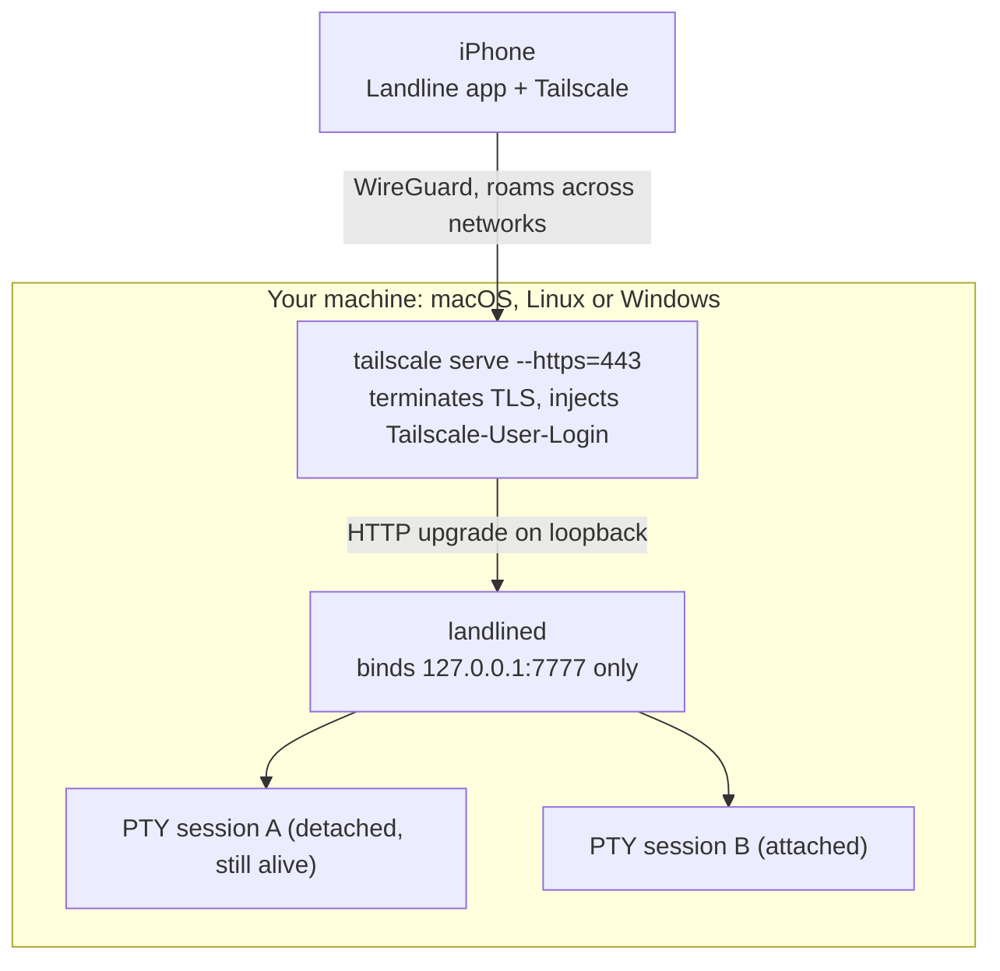

# Landline

A fixed, private, direct line to every machine you own. Terminal on your iPhone, over your own tailnet.

[](https://github.com/mhrsntrk/landline/actions/workflows/ci.yml)
[](LICENSE)
[](#quickstart)

Landline is two pieces: `landlined`, a small Rust daemon you run on each machine you own, and a
native iOS app that gives you a real shell on any of them. There is no hosted service, no account,
no open port, no VPN profile, and no SSH key to manage. Tailscale already put your machines on one
private network; this is the client that makes that network usable from a phone. Terminal only, and
that is permanent: screen sharing is a non-goal, not a missing feature.

<!-- demo: drop the recording at docs/media/demo.gif and replace this comment with
      -->

## Honest comparison

Tailscale SSH plus a good terminal app already gives you a shell on all of your machines today. If
that works for you, keep using it. What Landline adds is narrow and specific:

- One app that lists every machine you own, one tap to switch, no host config files.
- Sessions that survive the subway. The daemon keeps the PTY alive and replays scrollback on reattach.
- A keyboard built for shells instead of prose.
- Nothing to configure on the phone beyond installing Tailscale.

## How it works



One WebSocket at `GET /v1/shell`, binary frames, documented in
[docs/PROTOCOL.md](docs/PROTOCOL.md). The phone speaks plain `URLSessionWebSocketTask` to a URL with
a real Let's Encrypt certificate on `*.ts.net`, so there is no WebRTC stack, no signaling server, and
no certificate pinning code anywhere in the client.

## Quickstart

### On each machine

```sh
brew install mhrsntrk/tap/landline    # macOS

# macOS or Linux, without Homebrew (Windows: grab landlined.exe from the releases page)
curl -fsSL https://raw.githubusercontent.com/mhrsntrk/landline/main/packaging/install.sh | sh
```

Then, on every host:

```sh
landlined install                                       # launchd, systemd user unit, or scheduled task at logon
tailscale serve --bg --https=443 http://127.0.0.1:7777  # terminate TLS on the tailnet, proxy to the daemon
```

Add your tailnet login to the config, otherwise the daemon fails closed and rejects everyone:

```sh
landlined config-path        # prints the config file path for this platform
landlined set-unlock         # optional second factor, argon2id hashed into the config
```

```toml
allowed_logins = ["you@example.com"]
```

Now check the machine end to end:

```console
$ landlined doctor
tailscale        ok (1.102.3)
backend          ok
magicdns         ok (tail1a2b3.ts.net)
serve            ok
listener         ok
admin socket     ok
allowed_logins   ok (1 login(s))
app url          ok (wss://macbook.tail1a2b3.ts.net/v1/shell)
```

`doctor` exits nonzero if any check fails, and every failure line carries the command that fixes it.
Serve configuration is per-machine state that drifts, so "why can I not reach the laptop" gets a
one-command answer.

### On your phone

1. Install Tailscale and sign in to the same tailnet.
2. Install Landline from the App Store, or build it yourself (see below).
3. Add a host: paste the hostname from the `app url` line, for example
   `macbook.tail1a2b3.ts.net`. Port 443, TLS on.
4. Tap it. You get a shell.

## What you get

- **Sessions that outlive the connection.** The daemon holds the PTY, the child process and a
  scrollback ring. Any transport drop is an implicit detach; reattaching replays the ring and
  resizes the PTY to the phone's current geometry so full-screen programs repaint.
- **Multi-host list.** Name, `ts.net` hostname, port, TLS toggle. Manually entered, no discovery.
- **Per-host unlock secret.** Optional, argon2id hashed in the daemon config, verified over the
  WebSocket before any PTY is spawned, with exponential backoff and lockout after 10 failures.
  Unlock is per connection: a stolen session id alone is never enough.
- **Tailnet identity checking.** The daemon allowlists logins and answers everything else with a
  plain HTTP 403 before the upgrade completes.
- **Face ID gate** per host on the phone, backed by the iOS Keychain for the stored unlock secret.
- **A key bar for shells.** Esc, Tab, sticky Ctrl, arrows, and `~ | / -` above the keyboard.
- **`landline-cli`**, a raw-mode terminal test client that speaks the same protocol, for testing a
  host without a phone in your hand.

Known limitation, stated plainly: the scrollback replay is a raw byte ring, so a replay can start
mid escape sequence. The daemon sends `\x1b[2J\x1b[H` first, which hides most of it, but the correct
fix is a server-side screen state model like tmux and mosh maintain. That is not built.

## Security

Full model in [docs/SCOPE.md, section 4](docs/SCOPE.md#4-security-model). Policy and reporting in
[SECURITY.md](SECURITY.md).

- `landlined` binds loopback only, never `0.0.0.0`. A machine on the same LAN that is not on your
  tailnet cannot reach the port at all.
- `tailscale serve` terminates TLS and injects `Tailscale-User-Login`. The daemon checks that header
  against `allowed_logins` before the WebSocket upgrade completes, and an empty allowlist rejects
  everyone.
- Serve strips incoming `Tailscale-*` headers before injecting its own, so a tailnet peer cannot
  forge an identity. This was verified empirically on tailscale 1.102.3, not just taken from the
  docs: a request carrying a forged `Tailscale-User-Login` reached the backend with the forged value
  replaced by the real one.
- Tailnet ACLs narrow reachability further:

  ```jsonc
  { "grants": [
      { "src": ["tag:phone"], "dst": ["tag:landlinehost"], "ip": ["tcp:443"] }
  ] }
  ```

- **The known limitation:** any local process on the host can connect to `127.0.0.1:7777` directly,
  bypassing serve, and supply its own identity header. `tailscale serve` has no unix socket backend,
  so filesystem permissions cannot be the boundary. On a single-user laptop this is close to
  irrelevant. On a shared server it is not, and the unlock secret is what stands between a local
  process and a shell it does not already have. Set one there. A hardened mode that drops serve and
  identifies peers via the tailscaled WhoIs endpoint is designed in SCOPE 4.3 but not built.

Not defended against: a compromised tailnet coordination server, an unlocked jailbroken phone, or
anyone with physical root on a host, who does not need this app to get a shell.

## Configuration

TOML. Run `landlined config-path` to find it: `~/Library/Application Support/landline/config.toml`
on macOS, `~/.config/landline/config.toml` on Linux, `%APPDATA%\landline\config.toml` on Windows.
Any key you omit falls back to its default.

| Key | Default | Meaning |
|---|---|---|
| `listen` | `"127.0.0.1:7777"` | Address the WebSocket server binds. Keep it on loopback. |
| `allowed_logins` | `[]` | Tailnet logins allowed in. Empty rejects everyone (fail closed). |
| `shell` | `""` | Shell to spawn. Empty resolves `$SHELL`, else `/bin/sh`; on Windows `pwsh.exe`, then `powershell.exe`, then `cmd.exe`. |
| `session_ttl_hours` | `24` | How long a detached session survives without an attached client. |
| `scrollback_bytes` | `262144` | Per-session replay ring size. |
| `max_sessions` | `8` | Concurrent session cap. |
| `unlock_hash` | `""` | Argon2id PHC hash of the unlock secret. Empty means no unlock required. Write it with `set-unlock`, not by hand. |

The config file is written with mode `0600` on Unix.

## CLI reference

| Command | What it does |
|---|---|
| `landlined serve` | Run the daemon in the foreground. This is what the service unit runs. |
| `landlined install` | Install the service unit: launchd plist, systemd user unit, or Windows scheduled task at logon. |
| `landlined uninstall` | Remove it. |
| `landlined status` | Daemon up? Session summary, tailscale backend state. |
| `landlined doctor` | Full diagnosis: tailscale, backend, MagicDNS, serve mapping, listener, admin socket, allowlist, app url. |
| `landlined sessions list` | List live and detached sessions. |
| `landlined sessions kill <id>` | Terminate one session. |
| `landlined config-path` | Print the config file path. |
| `landlined set-unlock [--clear]` | Prompt for an unlock secret and argon2id hash it into the config, or clear it. |

`sessions list` and `sessions kill` talk to the daemon over a unix socket next to the config file,
so they are not supported on Windows yet.

## Building from source

The daemon and the test client:

```sh
cargo build --release            # target/release/landlined, target/release/landline-cli
cargo test --workspace
```

CI runs fmt, clippy with `-D warnings`, and the test suite on Linux, macOS and Windows.

The iOS app:

```sh
cd ios
xcodegen generate                # writes Landline.xcodeproj from project.yml
open Landline.xcodeproj          # then build and run
```

SwiftTerm is fetched through Swift Package Manager, so the first build needs a network. Deployment
target is iOS 17. Simulator builds need no signing team; running on your own device needs your own.

Building the client yourself is fully supported and is the point of this being open source. The paid
App Store build is a convenience for people who do not want a toolchain, and a tip jar. It is not a
moat, and nothing in the daemon checks where your copy of the app came from.

There is also a browser test harness at `harness/index.html`, served by the daemon's dev-only
`harness` cargo feature. That feature bypasses authentication and refuses to compile in release
builds on purpose.

## Project status

Early, and honest about it.

- **Daemon and protocol: working and tested.** PTY sessions, scrollback replay, resume, unlock
  gating, identity checking, service installation and `doctor` are implemented and covered by the
  Rust test suite, including round-trip tests that drive a real WebSocket against a real PTY.
- **iOS app: builds, wire format unit-tested, path freshly written.** Frame encoding and decoding
  have unit tests. The full phone-to-daemon path (connect, unlock, attach, background, reattach) is
  new code that has not yet had real daily use, so expect rough edges around backgrounding.
- **Windows** is the least exercised host. ConPTY resize and signal semantics differ from Unix, and
  `sessions` has no admin socket there yet.

What is planned next is in [docs/ROADMAP.md](docs/ROADMAP.md). Issues and pull requests are welcome;
see [CONTRIBUTING.md](CONTRIBUTING.md).

## Non-goals

Stated up front so they stay dead: no screen sharing or remote desktop, ever. No file manager or
SFTP browser. No port forwarding UI. No Android, no web client, no desktop client. No hosted
service, no accounts, no backend to trust. No multi-user or team features: one person, N machines.

## Documentation

- [docs/SCOPE.md](docs/SCOPE.md): what this is, non-goals, architecture, security model, session design.
- [docs/PROTOCOL.md](docs/PROTOCOL.md): wire protocol version 1, normative.
- [docs/ROADMAP.md](docs/ROADMAP.md): what is next.
- [SECURITY.md](SECURITY.md): reporting a vulnerability.
- [CONTRIBUTING.md](CONTRIBUTING.md): how to build, test and submit changes.

## License

MIT, across the whole repository, daemon and iOS client alike. See [LICENSE](LICENSE).
